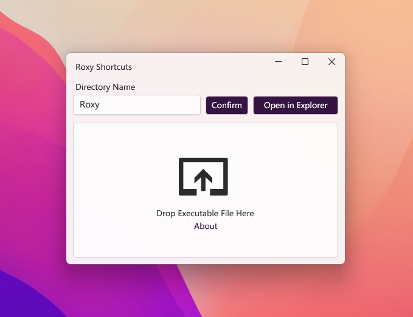

### 💔Deprecated

Roxy is using WPF Drop File API. However, due to Windows UAC, WPF Drop API cannot work in Administrator Mode which is a necessary permission to create shortcuts in the Start menu, so this project has been deprecated.

Still want to use Roxy?  [See the solution](https://www.codeproject.com/Questions/5306068/How-to-enable-drag-and-drop-feature-in-my-WPF-appl)

# Roxy Shortcuts

Roxy helps you to create shortcuts of executable(.exe) files on Windows 11 Start menu more comfortably. No need to add shortcuts one by one torturously!

*Roxy* is named after the Japanese light novel [*Mushoku Tensei*](https://en.wikipedia.org/wiki/Mushoku_Tensei)

## Features

- **Fluent Design**: Thanks to WPF UI, Roxy gets the latest Fluent Design appearance with Mica effect.
- **Dark/Light Mode**: The theme will change automatically along with system.
- **Easy to use**: Perhaps.

## Prerequisite

- Windows 11
- .NET 6.0 Runtime

## Showcase

## Special Thanks

- [WPF UI](https://github.com/lepoco/wpfui)
- [JetBrains ReSharper](https://www.jetbrains.com/resharper/)
- [JetBrains Rider](https://www.jetbrains.com/rider/)

## License
Under AGPL v3.0

