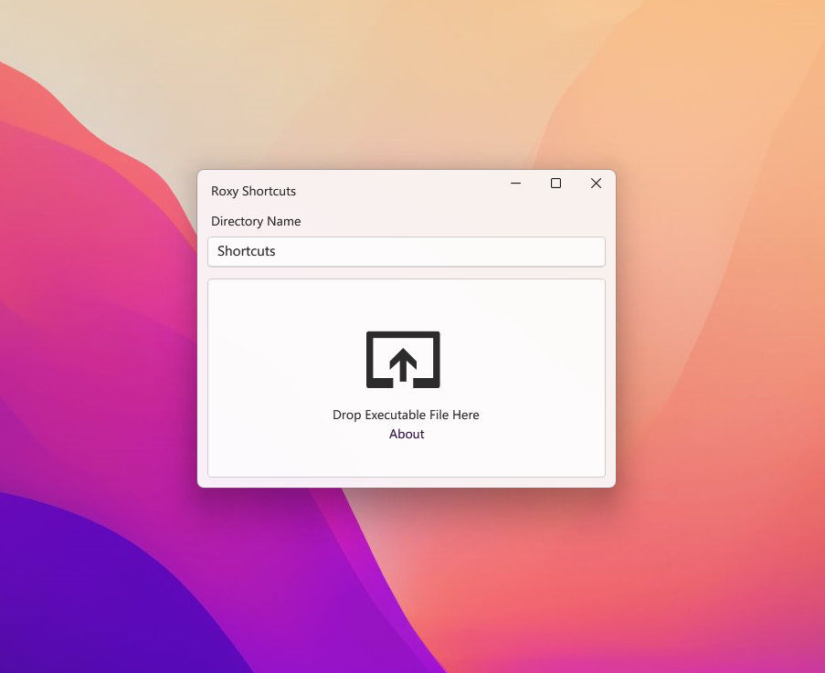

## ⚠️ Still work in progress

# Roxy Shortcuts

Roxy helps you to create App shortcuts on Windows 11 Start menu more convenient and comfortable. No need to add shortcuts one by one torturously!

*Roxy* is named after the Japanese light novel [*Mushoku Tensei*](https://en.wikipedia.org/wiki/Mushoku_Tensei)

## Features

- **Fluent Design**: Thanks to WPF UI, Roxy gets the latest Fluent Design appearance with Mica effect.
- **Dark/Light Mode**: The theme will change automatically along with system.
- **Easy to use**: Maybe.

## Prerequisite

- Windows 11
- .NET 6.0 Runtime

## Showcase

## Special Thanks

- [WPF UI](https://github.com/lepoco/wpfui)
- [JetBrains ReSharper](https://www.jetbrains.com/resharper/)
- [JetBrains Rider](https://www.jetbrains.com/rider/)

## License
Under AGPL v3.0

